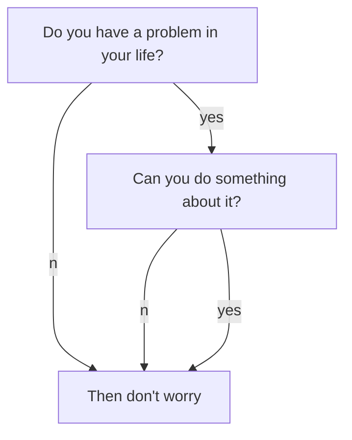

If you see this page, that means you have setup your site. enjoy! :ghost: :ghost: :ghost:

You may want to [config the site](https://tianqi.name/jekyll-TeXt-theme/docs/en/configuration) or [writing a post](https://tianqi.name/jekyll-TeXt-theme/docs/en/writing-posts) next. Please feel free to [create an issue](https://github.com/kitian616/jekyll-TeXt-theme/issues) or [send me email](mailto:kitian616@outlook.com) if you have any questions.

<!--more-->

---

If you like TeXt, don't forget to give me a star. :star2:

[](https://github.com/kitian616/jekyll-TeXt-theme/)



```chart
{
  "type": "polarArea",
  "data": {
    "datasets": [
      {
        "data": [
          11,
          16,
          7,
          3,
          14
        ],
        "backgroundColor": [
          "#FF6384",
          "#4BC0C0",
          "#FFCE56",
          "#E7E9ED",
          "#36A2EB"
        ],
        "label": "My dataset"
      }
    ],
    "labels": [
      "Red",
      "Green",
      "Yellow",
      "Grey",
      "Blue"
    ]
  },
  "options": {}
}
```